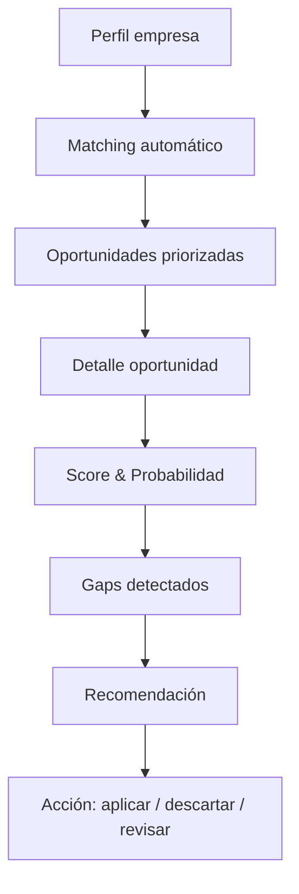

# 🚀 TenderAI — Product Visuals & Mockups

**Team:** Jhosef Cardich · Eduardo Cifrian · Mónica Varas · Jorge Ulecia  

[]()
[]()
[]()
[]()

---

## 🧠 Overview

TenderAI es una plataforma SaaS que permite a empresas y consultoras:

- Identificar oportunidades (licitaciones y ayudas)
- Evaluar su encaje con datos reales
- Priorizar con scoring predictivo
- Detectar qué les falta para competir
- Tomar decisiones accionables

> Reducimos fricción operativa y aumentamos la probabilidad de éxito.

---

## 🎯 Scope

Este repositorio NO contiene backend ni lógica productiva.  
Su objetivo es **visualizar el producto**:

- 🧩 Mockups de UI  
- 🔄 Flujos de usuario (UX)  
- 📊 Diagramas funcionales  
- 🎤 Assets para presentaciones  

---

## ⚙️ Core Flow



---

## 📚 Índice de Flujos

1. [flow_000_main_journey.md](docs/flows/flow_000_main_journey.md) - Main Journey
2. [flow_001_dashboard.md](docs/flows/flow_001_dashboard.md) - Dashboard
3. [flow_002_company_profile.md](docs/flows/flow_002_company_profile.md) - Company Profile
4. [flow_003_scoring.md](docs/flows/flow_003_scoring.md) - Scoring
5. [flow_004_decision.md](docs/flows/flow_004_decision.md) - Decision
6. [flow_005_pipeline.md](docs/flows/flow_005_pipeline.md) - Pipeline
7. [flow_006_tender_execution.md](docs/flows/flow_006_tender_execution.md) - Tender Execution
8. [flow_007_reporting.md](docs/flows/flow_007_reporting.md) - Reporting


# React + TypeScript + Vite

This template provides a minimal setup to get React working in Vite with HMR and some ESLint rules.

Currently, two official plugins are available:

- [@vitejs/plugin-react](https://github.com/vitejs/vite-plugin-react/blob/main/packages/plugin-react) uses [Oxc](https://oxc.rs)
- [@vitejs/plugin-react-swc](https://github.com/vitejs/vite-plugin-react/blob/main/packages/plugin-react-swc) uses [SWC](https://swc.rs/)

## React Compiler

The React Compiler is not enabled on this template because of its impact on dev & build performances. To add it, see [this documentation](https://react.dev/learn/react-compiler/installation).

## Expanding the ESLint configuration

If you are developing a production application, we recommend updating the configuration to enable type-aware lint rules:

```js
export default defineConfig([
  globalIgnores(['dist']),
  {
    files: ['**/*.{ts,tsx}'],
    extends: [
      // Other configs...

      // Remove tseslint.configs.recommended and replace with this
      tseslint.configs.recommendedTypeChecked,
      // Alternatively, use this for stricter rules
      tseslint.configs.strictTypeChecked,
      // Optionally, add this for stylistic rules
      tseslint.configs.stylisticTypeChecked,

      // Other configs...
    ],
    languageOptions: {
      parserOptions: {
        project: ['./tsconfig.node.json', './tsconfig.app.json'],
        tsconfigRootDir: import.meta.dirname,
      },
      // other options...
    },
  },
])
```

You can also install [eslint-plugin-react-x](https://github.com/Rel1cx/eslint-react/tree/main/packages/plugins/eslint-plugin-react-x) and [eslint-plugin-react-dom](https://github.com/Rel1cx/eslint-react/tree/main/packages/plugins/eslint-plugin-react-dom) for React-specific lint rules:

```js
// eslint.config.js
import reactX from 'eslint-plugin-react-x'
import reactDom from 'eslint-plugin-react-dom'

export default defineConfig([
  globalIgnores(['dist']),
  {
    files: ['**/*.{ts,tsx}'],
    extends: [
      // Other configs...
      // Enable lint rules for React
      reactX.configs['recommended-typescript'],
      // Enable lint rules for React DOM
      reactDom.configs.recommended,
    ],
    languageOptions: {
      parserOptions: {
        project: ['./tsconfig.node.json', './tsconfig.app.json'],
        tsconfigRootDir: import.meta.dirname,
      },
      // other options...
    },
  },
])
```
