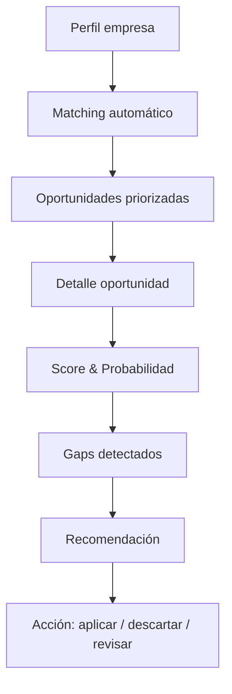

# 🚀 TenderAI — Product Visuals & Mockups

**Team:** Jhosef Cardich · Eduardo Cifrian · Mónica Varas · Jorge Ulecia  

---

## 🧠 Overview

TenderAI es una plataforma SaaS que permite a empresas y consultoras:

- Identificar oportunidades (licitaciones y ayudas)
- Evaluar su encaje con datos reales
- Priorizar con scoring predictivo
- Detectar qué les falta para competir
- Tomar decisiones accionables

> Reducimos fricción operativa y aumentamos la probabilidad de éxito.

---

## 🎯 Scope

Este repositorio NO contiene backend ni lógica productiva.  
Su objetivo es **visualizar el producto**:

- 🧩 Mockups de UI  
- 🔄 Flujos de usuario (UX)  
- 📊 Diagramas funcionales  
- 🎤 Assets para presentaciones  

---

## ⚙️ Core Flow

---

## 📚 Índice de Flujos

1. [flow_000_main_journey.md](flow_000_main_journey.md) - Main Journey
2. [flow_001_dashboard.md](flow_001_dashboard.md) - Dashboard
3. [flow_002_company_profile.md](flow_002_company_profile.md) - Company Profile
4. [flow_003_scoring.md](flow_003_scoring.md) - Scoring
5. [flow_004_decision.md](flow_004_decision.md) - Decision
6. [flow_005_pipeline.md](flow_005_pipeline.md) - Pipeline
7. [flow_006_tender_execution.md](flow_006_tender_execution.md) - Tender Execution
8. [flow_007_reporting.md](flow_007_reporting.md) - Reporting
