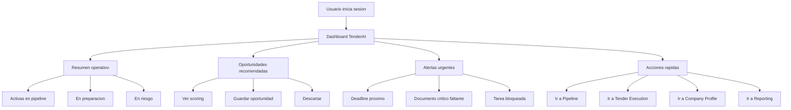

# Flow 001 - Dashboard

```mermaid
flowchart TD
    A[Usuario inicia sesion] --> B[Dashboard TenderAI]

    B --> C[Resumen operativo]
    B --> D[Oportunidades recomendadas]
    B --> E[Alertas urgentes]
    B --> F[Acciones rapidas]

    C --> C1[Activas en pipeline]
    C --> C2[En preparacion]
    C --> C3[En riesgo]

    D --> D1[Ver scoring]
    D --> D2[Guardar oportunidad]
    D --> D3[Descartar]

    E --> E1[Deadline proximo]
    E --> E2[Documento critico faltante]
    E --> E3[Tarea bloqueada]

    F --> F1[Ir a Pipeline]
    F --> F2[Ir a Tender Execution]
    F --> F3[Ir a Company Profile]
    F --> F4[Ir a Reporting]
```
