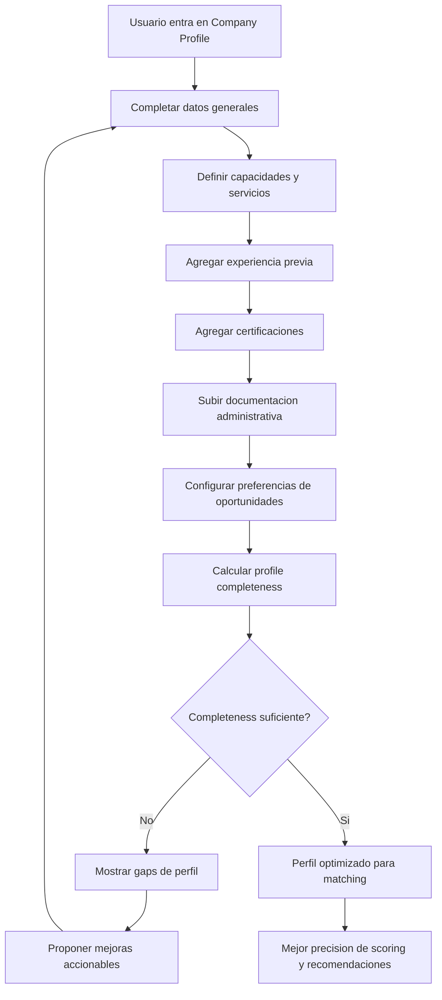

# Flow 002 - Company Profile

```mermaid
flowchart TD
    A[Usuario entra en Company Profile] --> B[Completar datos generales]

    B --> C[Definir capacidades y servicios]
    C --> D[Agregar experiencia previa]
    D --> E[Agregar certificaciones]
    E --> F[Subir documentacion administrativa]
    F --> G[Configurar preferencias de oportunidades]

    G --> H[Calcular profile completeness]
    H --> I{Completeness suficiente?}

    I -->|No| J[Mostrar gaps de perfil]
    J --> K[Proponer mejoras accionables]
    K --> B

    I -->|Si| L[Perfil optimizado para matching]
    L --> M[Mejor precision de scoring y recomendaciones]
```
