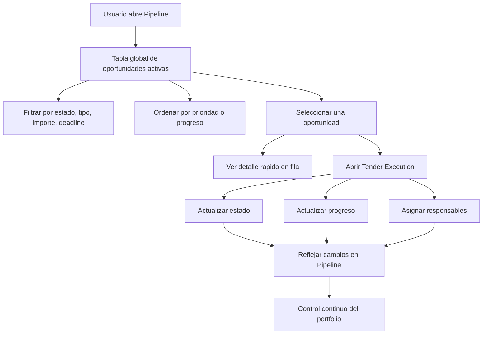

# Flow 005 - Pipeline

```mermaid
flowchart TD
    A[Usuario abre Pipeline] --> B[Tabla global de oportunidades activas]

    B --> C[Filtrar por estado, tipo, importe, deadline]
    B --> D[Ordenar por prioridad o progreso]
    B --> E[Seleccionar una oportunidad]

    E --> F[Ver detalle rapido en fila]
    E --> G[Abrir Tender Execution]

    G --> H[Actualizar estado]
    G --> I[Actualizar progreso]
    G --> J[Asignar responsables]

    H --> K[Reflejar cambios en Pipeline]
    I --> K
    J --> K

    K --> L[Control continuo del portfolio]
```
