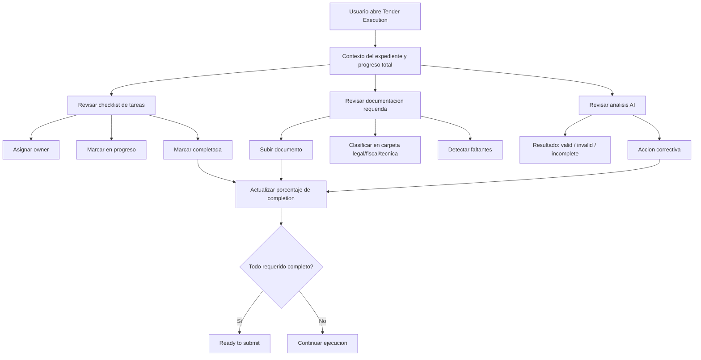

# Flow 006 - Tender Execution

```mermaid
flowchart TD
    A[Usuario abre Tender Execution] --> B[Contexto del expediente y progreso total]

    B --> C[Revisar checklist de tareas]
    B --> D[Revisar documentacion requerida]
    B --> E[Revisar analisis AI]

    C --> C1[Asignar owner]
    C --> C2[Marcar en progreso]
    C --> C3[Marcar completada]

    D --> D1[Subir documento]
    D --> D2[Clasificar en carpeta legal/fiscal/tecnica]
    D --> D3[Detectar faltantes]

    E --> E1[Resultado: valid / invalid / incomplete]
    E --> E2[Accion correctiva]

    C3 --> F[Actualizar porcentaje de completion]
    D1 --> F
    E2 --> F

    F --> G{Todo requerido completo?}
    G -->|Si| H[Ready to submit]
    G -->|No| I[Continuar ejecucion]
```
