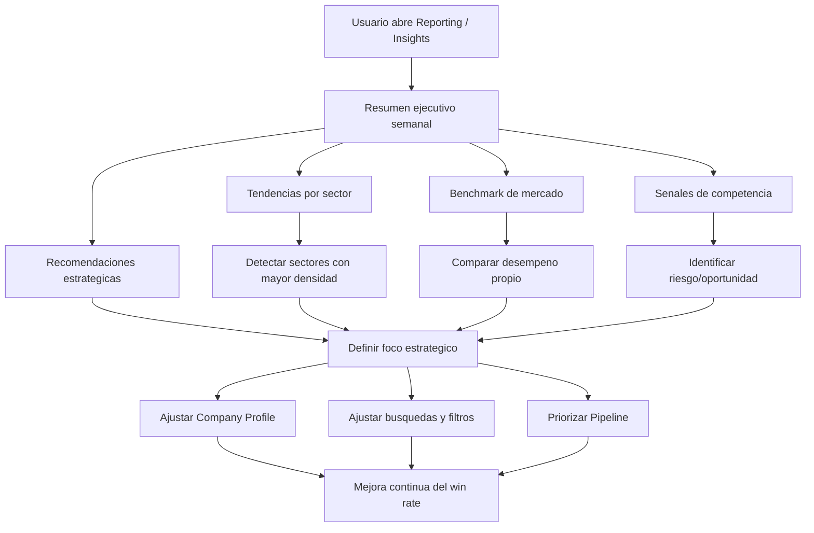

# Flow 007 - Reporting

```mermaid
flowchart TD
    A[Usuario abre Reporting / Insights] --> B[Resumen ejecutivo semanal]

    B --> C[Tendencias por sector]
    B --> D[Benchmark de mercado]
    B --> E[Senales de competencia]
    B --> F[Recomendaciones estrategicas]

    C --> G[Detectar sectores con mayor densidad]
    D --> H[Comparar desempeno propio]
    E --> I[Identificar riesgo/oportunidad]

    F --> J[Definir foco estrategico]
    G --> J
    H --> J
    I --> J

    J --> K[Ajustar Company Profile]
    J --> L[Ajustar busquedas y filtros]
    J --> M[Priorizar Pipeline]

    K --> N[Mejora continua del win rate]
    L --> N
    M --> N
```
